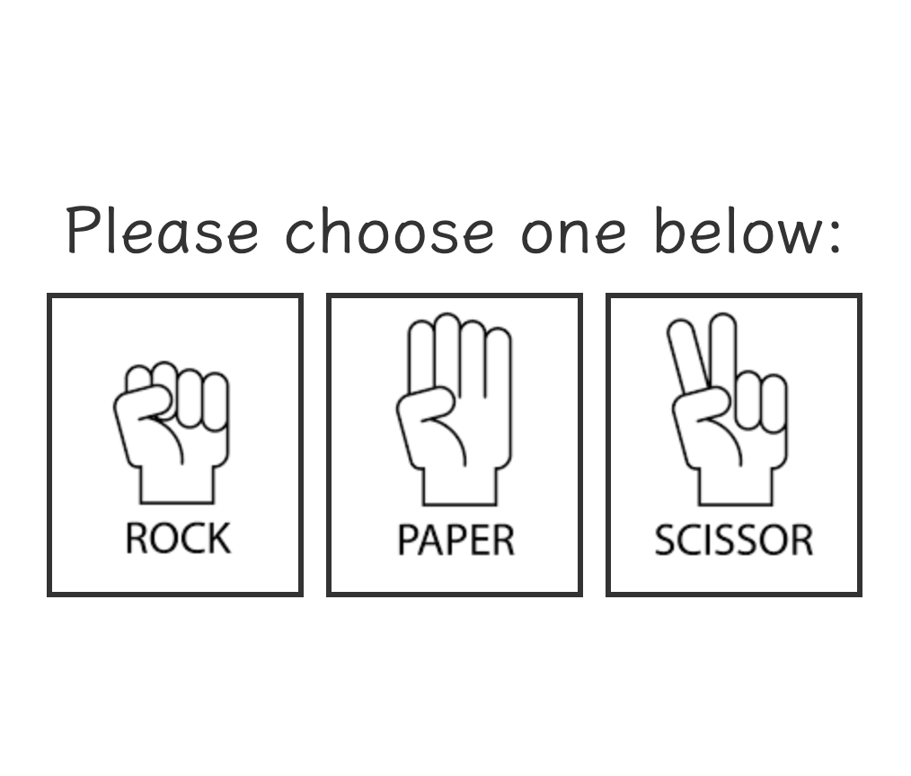
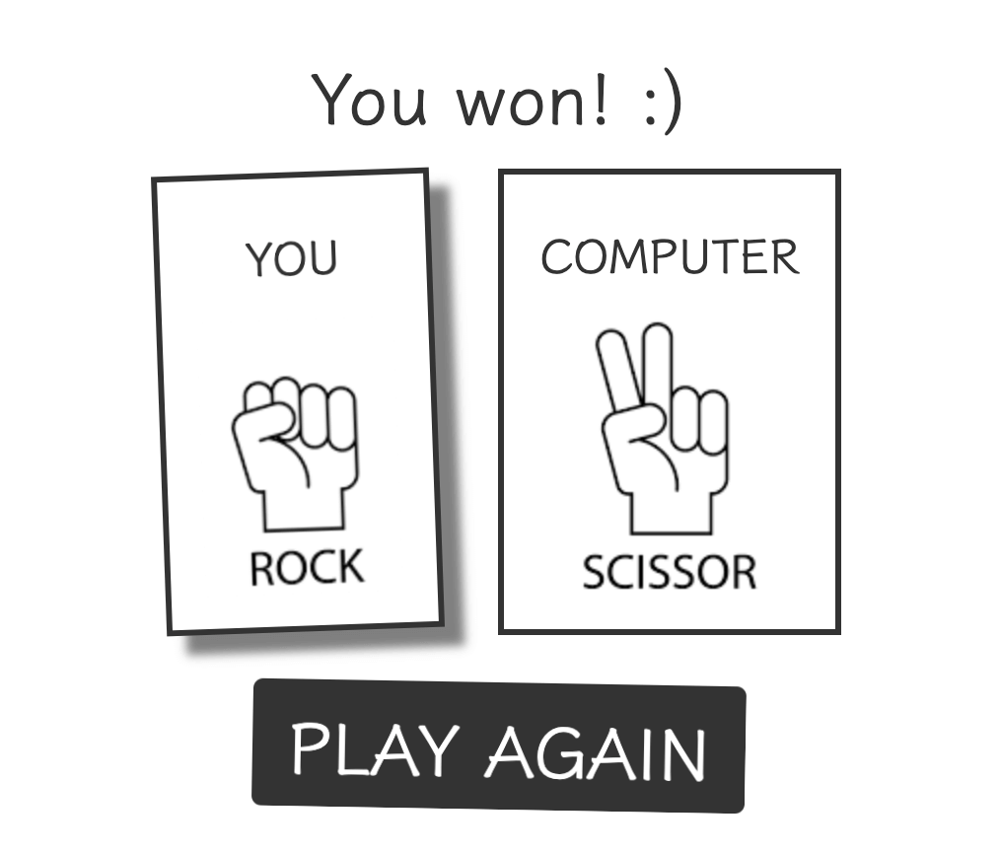
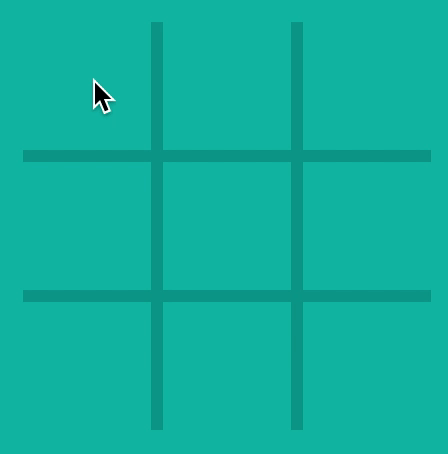
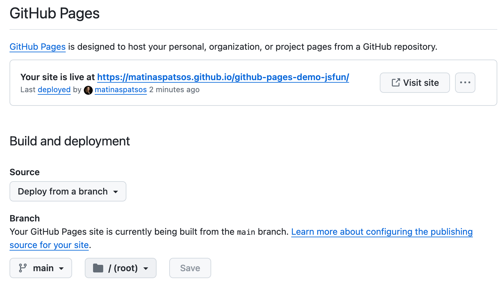

# Final Project - the Document Object Model (DOM)

**Due Date: January 15, 2024 End-of-Day**

For your final project, you will be developing a front-end web based user interface in Vanilla JavaScript. You you have a choice of creating:

1. A game of "Rock, Paper, Scissors"
2. A calculator
3. A game of "Tic-Tac-Toe"

## Project Goals

- To put together and make practical use of what was taught in class.
- To learn about developer practices, like setting up a new website, maintaining your own git repository and writing a _README.md_.
- To build a portfolio piece to show off to potential employers.

This project will put together these topics that were covered in class:

- Fundamentals of JavaScript
- Working with the Document Object Model (DOM)
- Handling events
- Structuring your project

## Projects

Please select one of the project ideas below.

### Option 1: Rock, Paper, Scissors Requirements

Create a web version of the game ["Rock", "Paper", "Scissors"](https://www.youtube.com/watch?v=ND4fd6yScBM). Your user will be playing against a computer AI.





#### UI Requirements

If you choose this project, you must meet the following UI requirements:

- There should be at least two screens:
  - In one screen, the user should select either rock, paper, or scissors (or something similar).
  - In a following screen, reveal who has won the game.
- You must write some code to select rock, paper, or scissors for the computer at random.
- The user should be able to play again without refreshing the screen.

Feel free to add to more features to the game.

#### Coding Requirements

Each project must also meet the following requirements:

- You put your code in file(s) external to the HTML that are loaded with `<script>` tags. All JavaScript code should be enclosed within an Immediately Invoked Functional Expression (IIFE). For an example of this, please see the "Hints" section below.
- You must use Vanilla JavaScript to query the DOM (e.g. `document.querySelector` or `document.querySelectorAll`).
- You must handle at least two events.
- Your code should not contain `var`.
- There should not be any major bugs.
- Your website should not crash at any point.

You must use Vanilla JavaScript to manipulate the DOM. That means you cannot use a library like jQuery or React. If you do, we will not accept your work.

#### Submission Requirements

- Your project code is available on Github.
- Your project is hosted on Github Pages or some other hosting platform.

### Option 2: Calculator

Build a simple calculator. For example, you could build a calculator that is similar to [Google's calculator.](https://www.google.com/search?q=calculator)

#### UI Requirements

- The user must be able to enter numbers onto the screen. (There is more than one way to this. For example, the user can type the numbers, or the user can click on buttons on the screen.)
- The user must be able to select from the following operations correctly: add, subtract, multiple and divide.
- You should display the results of an operation on the screen.
- The user should be able to clear the calculator, erasing any user input and any results, and be able to start again.

#### Coding Requirements

Each project must also meet the following requirements:

- You put your code in file(s) external to the HTML that are loaded with `<script>` tags. All JavaScript code should be enclosed within an Immediately Invoked Functional Expression (IIFE). For an example of this, please see the "Hints" section below.
- You must use Vanilla JavaScript to query the DOM (e.g. `document.querySelector` or `document.querySelectorAll`).
- You must handle at least two events.
- Your code should not contain `var`.
- Your website should not crash at any point.

You must use Vanilla JavaScript to manipulate the DOM. That means you cannot use a library like jQuery or React. If you do, we will not accept your work.

#### Submission Requirements

- Your project code is available on Github.
- Your project is hosted on Github Pages or some other hosting platform.

Please note that with this project, there is a lot edge cases and a higher potential of bugs. For this reason, I would say it is harder to deliver a quality portfolio piece than it would be for the "Rock, Paper, Scissors" project.

### Option 3: Tic-Tac-Toe

Create a web version of the game [Tic-Tac-Toe](https://www.youtube.com/watch?v=3qzcAMShotQ). This will be a two player game, where each person takes turns.



#### UI Requirements

- You should display a Tic-Tac-Toe board on the screen.
- Game play should alternate between two players. One person should be an "X" and the other should be an "O" (or something equivalent). The game should let the players know who's turn it is.
- When a player takes their turn, they should select an empty cell on the screen. When they do so, draw their shape (either "X" or "O") in the cell.
- Whoever gets three marks in a row - this can be horizontally, vertically, or diagonally - wins the game. Let the players know who has won.
- At any point, the players should be able to restart or replay the game again without refreshing the screen.

#### Coding Requirements

Each project must also meet the following requirements:

- You put your code in file(s) external to the HTML that are loaded with `<script>` tags. All JavaScript code should be enclosed within an Immediately Invoked Functional Expression (IIFE). For an example of this, please see the "Hints" section below.
- You must use Vanilla JavaScript to query the DOM (e.g. `document.querySelector` or `document.querySelectorAll`).
- You must handle at least two events.
- Your code should not contain `var`.
- There should not be any major bugs.
- Your website should not crash at any point.

You must use Vanilla JavaScript to manipulate the DOM. That means you cannot use a library like jQuery or React. If you do, we will not accept your work.

#### Submission Requirements

- Your project code is available on Github.
- Your project is hosted on Github Pages or some other hosting platform.

## Structuring Your Project

Here are two different ways you can structure your project:

1. Load files with `<script>` (the oldest and simplest way) and use CDNs URLs for third party libraries
2. Install everything with NPM and use a tool like [Vite](https://vitejs.dev/), [Webpack](https://webpack.js.org/), or [Parcel.js](https://parceljs.org/). **Do not do this.** Although much of JavaScript development is this way today, this will take a significant amount of time to get started, configure, and build your project. If you are really interested in using these tools, we recommend you to wait until you have a completed your project and have it hosted on Github Pages. Then, you can always go back and redo the project with NPM and tooling.

Here is how you can use `<script>` tags.

Put your code in file(s) external to the HTML that are loaded with `<script>` tags, like this:

```html
<!DOCTYPE html>
<html lang="en">
  <head>
    <!-- ... -->
    <!-- Load CSS frameworks with CDNs -->
    <!-- UIkit CSS -->
    <link
      rel="stylesheet"
      href="https://cdn.jsdelivr.net/npm/uikit@3.21.16/dist/css/uikit.min.css"
    />
    <!-- Loading 3rd party libraries like AXIOS -->
    <!-- Look for "CDN" in the documentation -->
    <script src="https://cdn.jsdelivr.net/npm/axios/dist/axios.min.js"></script>

    <!-- Your code -->
    <script src="js/utils.js" defer></script>
    <script src="js/log.js" defer></script>
    <script src="js/dom.js" defer></script>
    <script src="js/app.js" defer></script>
  </head>
  <body>
    <!-- ... -->
  </body>
</html>
```

**In order for the site to work with Github Pages, your main HTML file must be called "index.html" and it must be in the root of you project.** (That means it cannot be inside of a folder in your project.) For more on Github Pages, see "Github Repository and Pages" below.

For any third parties, like CSS frameworks and JavaScript libraries, look for "CDN" in the instructions. A CDN is a URL that you can add to your HTML file(s).

You can share code between JavaScript files by attaching your code to the window like this:

```javascript
// Wrap in Immediately Invoked Functional Express (IIFE) to protect your code
(function () {
  const toTitleCase = (str) => {
    return str.replace(/\w\S*/g, function (txt) {
      return txt.charAt(0).toUpperCase() + txt.substr(1).toLowerCase();
    });
  };

  // Attach what you need to share between files to the window
  window.toTitleCase = toTitleCase;
})();
```

## Github Repository and Pages

You will need to [create a new public Github repository](https://help.github.com/en/articles/create-a-repo) for this project. It must be public. You should also include a _README.md_ and _.gitignore_ file.

Your _README.md_ file should be written in [Markdown](https://github.com/adam-p/markdown-here/wiki/Markdown-Cheatsheet). This should be written for employers who may be looking at your work. Describe your project and explain how to get started. You can find an example template of a _README.MD_ here:
https://github.com/othneildrew/Best-README-Template

You can generate _.gitignore_ file with [gitignore.io](https://www.toptal.com/developers/gitignore). If you have a _node_modules_ folder, be sure to include it in your _.gitignore_.

In addition to submitting code, you will need to submit a hosted version of your project. An easy way to do this is to publish your project with Github pages. Here are the steps for most projects.

1. Open you Github repository e.g. https://github.com/your-github-username/final-project for your project in a web browser.
2. Click on the "Settings" tab in the same toolbar that has "Code", "Issues", and "Pull Request". It should be on the right.
3. In the sidebar, click on "Pages".
4. Make sure that "Deploy from a branch" underneath "Source" is selected.
5. Underneath where it says "Branch", click on the dropdown that says "None" and select "main".
6. Make sure the second dropdown says "/ (root)".
7. Hit the "Save" button.
8. The next part make take a few minutes. Refresh the page every 20 seconds or so. should will see the URL for your published project (e.g. https://your-github-username.github.io/final-project). If you click on the link and click a page not found error, you can try opening it an Incognito window or another browser.



In the future, if you want to deploy any changes to your website:

1. Commit all of your changes
2. Run `git push origin main`

Then it should take a minute for the changes to go into effect.

## Project Design

We realize that we did not teach design in this class, but there is no way to get around the fact that design must be a part of the process. We will not grade your project on how good it looks, but a good design will make a better impression with employers, so please try to make your application look as nice as possible.

You are welcome to use a CSS frameworks like [Bootstrap](https://getbootstrap.com/docs/5.2/getting-started/introduction/), [Bulma](https://bulma.io/documentation/overview/start/), or [UIKit](https://getuikit.com/docs/introduction). You may see instructions to install with npm, yarn, pnmp, or some other package manager. If you haven't done this before, I would not recommend this. Instead, I would search for instructions on how to include your CSS framework over a CDN (Content Delivery Network). This means you will include the CSS with a `<link>` tag in your HTML file like this:

```html
<!DOCTYPE html>
<html lang="en">
  <head>
    <!-- ... --->
    <link rel="stylesheet" href="https://some.site/path/to/file.css" />
    <!-- ... --->
  </head>
  <!-- ... -->
</html>
```

## Code Quality

While you will not fail if you do not meet these quality requirements, we will ask you to resubmit your work if it is not up to a professional standard. One of the goals of this project is to help you build a portfolio. Just like an interviewer will judge you on your attire, employers will judge you on the neatness of your code.

- You should have _README.md_ written in Markdown. It should explain the purpose of the project, describe how to play the game, give instructions on how to install and start your project and credit yourself as the author. Here are some resources on creating _README.md_ files:
  - [Make a README](https://www.makeareadme.com/)
  - [Markdown cheatsheet](https://github.com/adam-p/markdown-here/wiki/Markdown-Cheatsheet)
- Add anything that should not be committed to your _.gitigore_ file. If applicable, the `node_modules` folder should be ignored.
- Choose descriptive and specific names for variables, constants, functions and anything else that is named.
- You must not leave any debugging statements in your code. This means when you commit your code, remove any `console.log` statements.
- Only have actual comments within comment tags. Do not commit code that you commented out for debugging purposes.
- No errors should appear in the console.
- Remove any code that is not being used. (This affects application load time as well as code quality.)
- Use proper indentation. (Prettier can take care of this.)

## Hints

Keep it simple. It is very easy to underestimate how much work your project will take. First, try to only meet the requirements in the description. If you have time, then you can work on doing more than what is described in the requirements.

Here is how you can wrap your code in an Immediately Invoked Functional Expression (IIFE). You will need to do this for you project.

```html
<!DOCTYPE html>
<html lang="en">
  <head>
    <!-- ... -->
    <script src="js/script.js" defer></script>
  </head>
  <body>
    <!-- ... -->
  </body>
</html>
```

```javascript
// Wrap in Immediately Invoked Functional Express (IIFE) to protect your code
(function () {
  // All of your code goes here
})();
```

For all projects, you may need to identify what the user clicked on. For example, you may have a single add event handler, and you want to know whether the user clicked on the "rock", "paper", or "scissors" button. One way you can do this is to use IDs:

```html


```

```javascript
// Target all three options (rock, paper, scissors)
const handSignals = document.querySelectorAll(".hand-signal");

// Loop through each option
handSignals.forEach((signal) => {
  // Attaches a click event
  signal.addEventListener("click", () => {
    // Gets the ID so you can figure out what the user clicked on
    const whatTheUserSelected = signal.id;
    alert("You picked " + whatTheUserSelected);
  });
});
```

Another option is to embed data with data attributes.

```html
<!-- Calculator buttons -->
<button data-number="0">0</button>
<button data-number="1">1</button>
<button data-number="2">2</button>
<!-- ... --->
```

```javascript
// Targets all the caluator buttons that are a number
const numberButtons = document.querySelectorAll("[data-number]");

// Loops through each button
numberButtons.forEach((button) => {
  // Attaches a click event
  button.addEventListener("click", () => {
    // Gets the value from a data attribute so you can figure out what the user clicked on
    const whatTheUserClickedOn = button.getAttribute('[data-number']);
    alert('You clicked on the number ' + whatTheUserClickedOn);
  });
});
```

For the "Tic-Tac-Toe" and "Rock, Paper, Scissors" games, you may want to store the winning combinations in a collection (array, object, array or objects, etc). Here is what you can use for "Tic-Tac-Toe":

```javascript
const winningConditions = [
  [0, 1, 2],
  [3, 4, 5],
  [6, 7, 8],
  [0, 3, 6],
  [1, 4, 7],
  [2, 5, 8],
  [0, 4, 8],
  [2, 4, 6],
];
```

## Project Help

If you need help, please schedule a 1-on-1 with your instructors or any of the CanCode Communities staff who is available to help.

## Project Submission

You will submit to following to both of you instructors by emailing it to Jamal (jamal@albanycancode.org) and Matina (matina@albanycancode.org) by the project deadline:

1. The link to your Github repository.
2. The link to you where your project is published. You can publish your project with Github Pages or you can a different hosting service.

Your project does not have to be 100% complete, but it does have to be presentable to employers. CanCode Communities will host your project in a public space and they will be sharing your work with employers.
